#  Documentación Técnica: Creación de Reportes de Facturación

##  Objetivo del Proyecto

Este proyecto lo hice con la finalidad de mostrar cómo se puede implementar un sistema de generación de reportes usando dos tecnologías diferentes: una aplicación de escritorio hecha en C# y una solución web usando PHP. La idea es que cualquier desarrollador (o incluso yo mismo en el futuro) pueda ver paso a paso cómo se arma este tipo de sistema, comparando cómo se hace en cada lenguaje.

Quise documentarlo de forma clara y sencilla para que sirva de guía, mostrando tanto lo que tienen en común como lo que cambia entre C# y PHP. Esto me ayudó a reforzar lo que aprendí sobre bases de datos, diseño de reportes y conexión con el sistema, y también a tener un recurso que puedo reutilizar o mejorar en otros proyectos similares.

##  Desarrollo del Módulo en C#

Este módulo fue desarrollado en Visual Studio, utilizando el lenguaje de programación C# y el enfoque de aplicación de escritorio con Windows Forms. Para la gestión de datos, se trabajó con una base de datos en SQL Server, administrada desde SQL Server Management Studio.

###  Dependencias del Proyecto

El proyecto hace uso de las siguientes librerías y herramientas:

- **Microsoft.ReportViewer.WinForms**: utilizada para diseñar y mostrar los reportes dentro de la interfaz del sistema.
- **System.Data.SqlClient**: permite establecer la conexión directa con la base de datos SQL Server para consultar y obtener los datos requeridos en los reportes.

###  Instalación de Paquetes Necesarios

Para poder generar reportes dentro de una aplicación de Windows Forms, es importante instalar el control `ReportViewer`. Esto se hace fácilmente desde el Administrador de paquetes NuGet, agregando el paquete **Microsoft.Reporting.WinForms**.

Este componente permite visualizar y trabajar con archivos `.rdlc` directamente en el formulario, facilitando la creación de reportes dinámicos y personalizados.

###  Creación del Formulario de Reporte

Es necesario agregar un nuevo formulario al proyecto, el cual estará destinado exclusivamente a mostrar el reporte generado. Este formulario contendrá el control `ReportViewer`, que será el encargado de visualizar los datos en formato de informe.

###  Diseño del Reporte (.rdlc)

Para diseñar el reporte, se añade al proyecto un nuevo archivo de tipo **Informe**, con extensión `.rdlc`. Este archivo permite definir de forma visual cómo se presentará la información, incluyendo tablas, encabezados, totales y más. Aquí es donde se personaliza el diseño del reporte según los datos que se quieran mostrar.
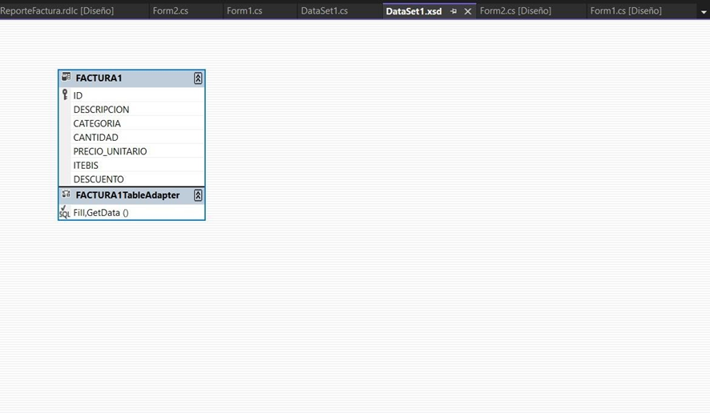
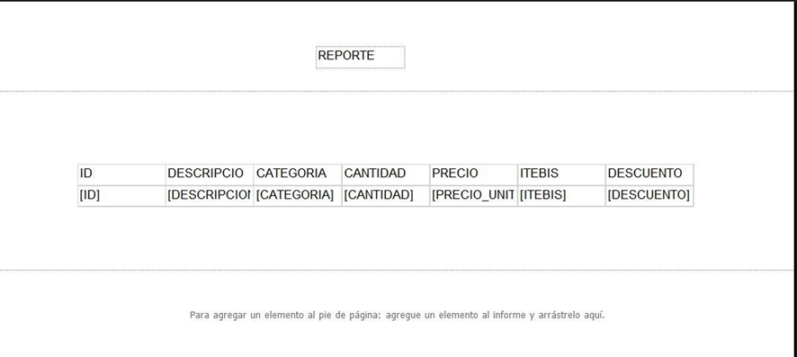

###  Visualización del Reporte

Una vez ejecutada la aplicación, al hacer clic en el botón destinado para ver el reporte, se abre el formulario que contiene el control `ReportViewer`. En este formulario se carga y muestra de manera estructurada toda la información proveniente de la tabla `Factura`, permitiendo al usuario visualizar los datos de forma clara y ordenada.
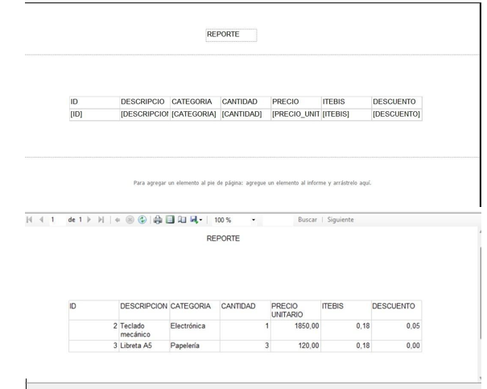

###  Base de Datos: `Factura`

Para este sistema se creó una base de datos llamada **Factura**, la cual se encarga de almacenar toda la información relacionada con las facturas registradas desde el formulario principal. Esta estructura permite gestionar de forma organizada cada uno de los registros generados por los usuarios.

###  Tabla Principal: `Factura`

Dentro de la base de datos, se definió una única tabla también llamada **Factura**, que contiene los campos necesarios para guardar todos los detalles de una factura. A continuación, se describen sus principales columnas:

- **ID**: Identificador único para cada factura. Se genera automáticamente.
- **DESCRIPCION**: Contiene el nombre del producto o servicio facturado.
- **CATEGORIA**: Clasifica el tipo de producto o servicio.
- **CANTIDAD**: Indica el número de unidades facturadas.
- **PRECIO_UNITARIO**: Precio por unidad del producto o servicio.
- **ITEBIS**: Campo destinado a almacenar el monto del impuesto aplicado.
- **DESCUENTO**: Registra cualquier rebaja o promoción aplicada al total de la factura.

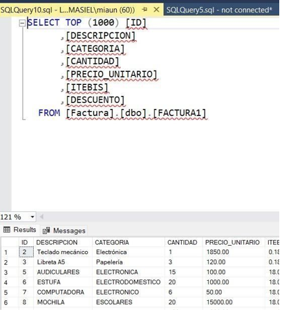

###  Paso 1: Crear el Formulario Principal

Lo primero que hay que hacer es abrir **Visual Studio** y crear un nuevo proyecto del tipo **Windows Forms App (.NET Framework)**.

Luego, en el formulario principal, se deben colocar los siguientes controles para permitir el ingreso y gestión de los datos:

- **Cajas de texto (TextBox)** para cada uno de los campos de la factura:  
  `ID`, `Descripción`, `Categoría`, `Cantidad`, `Precio Unitario`, `ITEBIS` y `Descuento`.

- **Botones funcionales** para realizar acciones básicas:
  - **Crear**: para guardar una nueva factura.
  - **Buscar**: para consultar registros existentes.
  - **Editar**: para modificar datos previamente ingresados.
  - **Limpiar**: para borrar el contenido de los campos y dejar el formulario listo para nuevos datos.

###  Paso 3: Guardar los datos en la base

Cuando se hace clic en el botón **Crear**, se ejecuta un bloque de código que primero valida que todos los campos estén llenos y luego guarda la información en la base de datos utilizando una sentencia `INSERT INTO`.
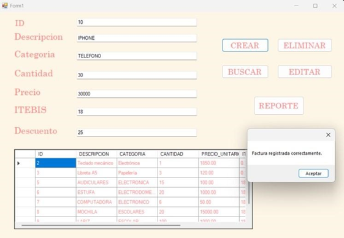

###  Paso 4: Consultar una factura

El botón **Buscar** permite encontrar una factura específica usando su `ID` como referencia. Al hacer clic, se ejecuta una consulta tipo:  
`SELECT * FROM Factura WHERE ID = @id`,  
lo que recupera todos los datos relacionados a ese registro si existe.
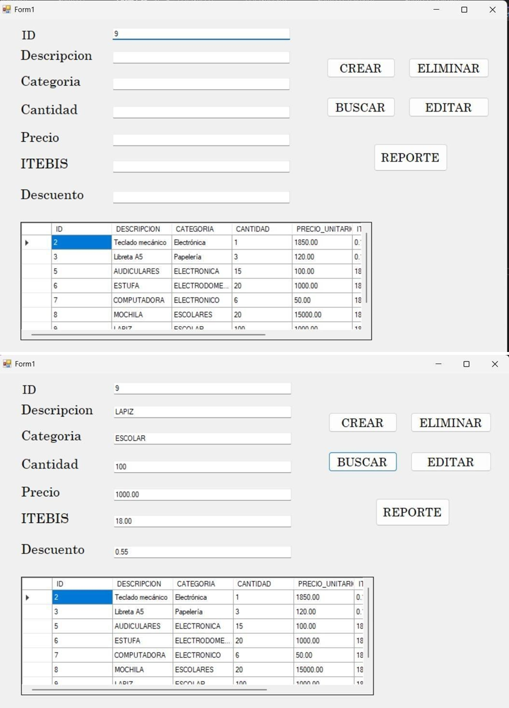

###  Paso 5: Modificar una factura existente

Con el botón **Editar**, se pueden actualizar los datos de una factura ya registrada. Se toma el `ID` como clave para ubicar el registro y se usa una sentencia `UPDATE` para aplicar los cambios correspondientes en la base.
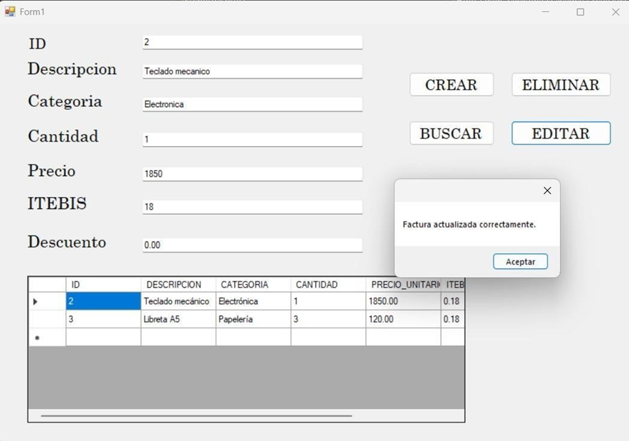

###  Botón Eliminar

Este botón permite borrar un registro específico de la base de datos. Al ingresar el identificador correspondiente y presionar **Eliminar**, se ejecuta una acción que elimina permanentemente la factura seleccionada, asegurando que los datos ya no aparezcan en el sistema ni en los reportes.
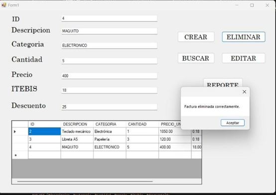

###  Paso 6: Visualizar todas las facturas

La función `CargarDatos()` se encarga de ejecutar una consulta `SELECT` general para traer todas las facturas guardadas en la tabla. Los resultados se muestran automáticamente en un `DataGridView`, lo que permite ver los registros de forma ordenada y práctica.
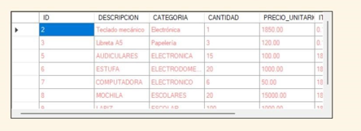

##  Proyecto en PHP para Generar Reportes PDF

Este proyecto es una página web sencilla creada en PHP, que permite generar y descargar un reporte en formato PDF con toda la información extraída de una tabla de la base de datos. Para crear el PDF, se utiliza la librería **DOMPDF**, que facilita convertir código HTML en documentos PDF.

El sistema está formado por varios archivos principales:

- Un archivo principal que muestra un botón para generar el reporte.
- Un script encargado de crear el PDF usando DOMPDF.
- Un archivo que maneja la conexión con la base de datos.
- Una plantilla HTML que define cómo se verá el reporte en PDF, es decir, su formato y diseño visual.

###  Generación del Reporte PDF con DOMPDF en PHP

Para crear el reporte en formato PDF, utilizamos la biblioteca **DOMPDF**, que convierte contenido HTML en archivos PDF directamente desde PHP.

#### Página Principal

Se diseñó una página PHP sencilla que contiene un enlace o botón con el texto **"Descargar reporte"** o **"Descargar PDF"**, que al hacer clic inicia la generación del documento.
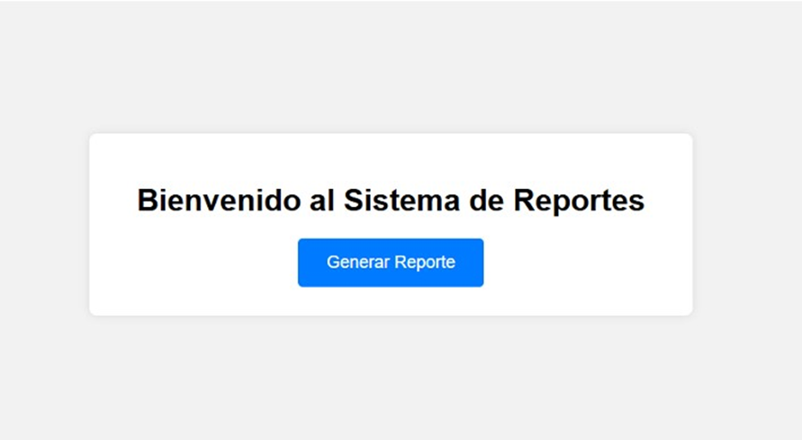

#### Proceso de Generación del Reporte

El archivo encargado de generar el PDF realiza estos pasos:

- Establece la conexión con la base de datos.
- Ejecuta una consulta para obtener todos los registros de la tabla correspondiente.
- Construye una plantilla HTML donde se inserta la información recuperada.
- Utiliza DOMPDF para transformar esa plantilla HTML en un archivo PDF.
- Finalmente, envía el PDF generado al navegador para que el usuario pueda descargarlo o visualizarlo.

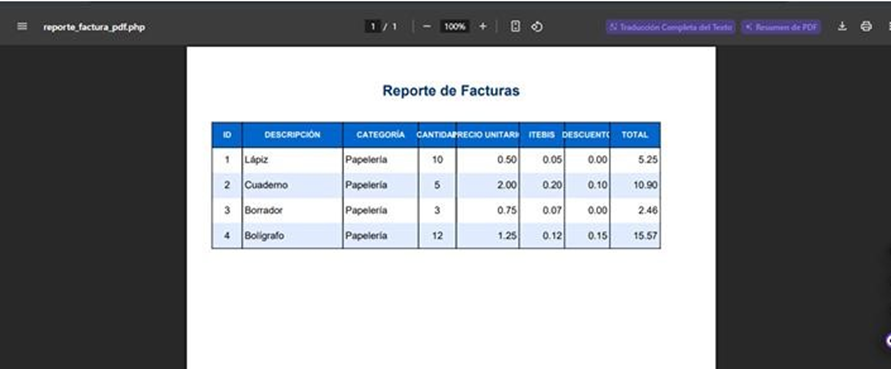

###  Creación de la Base de Datos y Tabla

Lo primero es crear una base de datos nueva, lo cual se puede hacer usando herramientas como **phpMyAdmin**, **MySQL Workbench** o directamente desde la consola de MySQL.
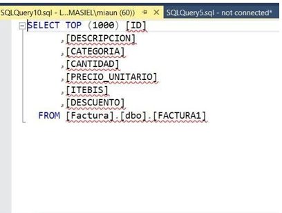

#### Estructura de la Tabla

Dentro de esta base de datos se crea una tabla que almacenará la información que se exportará al reporte. Esta tabla incluye campos esenciales como:  
`ID`, `Descripción`, `Categoría`, `Cantidad`, `Precio`, entre otros.
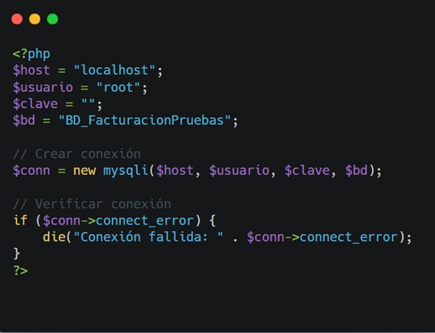

##  Conclusión

En este proyecto se logró implementar un sistema funcional de generación de reportes tanto en un entorno de escritorio con C# como en una aplicación web con PHP. A través del uso de herramientas específicas como ReportViewer y DOMPDF, se pudo mostrar cómo manejar datos desde una base de datos, crear reportes visuales y exportarlos en formatos accesibles para el usuario.

Este trabajo demuestra que, independientemente de la tecnología utilizada, es posible desarrollar soluciones eficientes para la gestión y presentación de información, adaptándose a diferentes plataformas y necesidades. Además, ofrece una base sólida para futuros desarrollos y mejoras en sistemas de reportes.

Con esta documentación, espero facilitar el aprendizaje y la implementación de estos procesos para otros desarrolladores que deseen crear proyectos similares.

